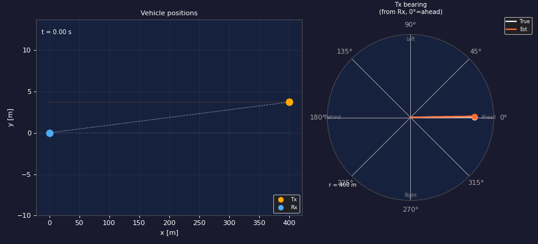

# PyDopplerSim

A Python-based baseband signal (RF) simulator that models Doppler behavior of concurrently mobile RX (receiver) and TX (transmitter) in radar/communication scenarios.



## Why PyDopplerSim?

PyDopplerSim is unique because it combines:
- **Mobile RX and TX** - Both transmitter and receiver can be in motion
- **True physical layer baseband signal processing** - Generates IQ (In-Phase/Quadrature) samples
- **AWGN modeling** - Additive White Gaussian Noise for realistic signal degradation
- **Python framework** - Easy to port to GNU Radio blocks

---

## Installation

```bash
# Clone the repository
git clone https://github.com/theTrueEnder/PyDopplerSim.git
cd PyDopplerSim

# Install dependencies
pip install -e ".[dev]"

# Run tests
pytest tests/ -v
```

---

## Quick Start

```bash
# Run all scenarios with default settings
python main.py

# Run a specific scenario
python main.py --scenario oncoming

# Save IQ to WAV file for replay
python main.py --scenario same-direction --save-wav output/

# Load IQ from WAV and regenerate plots
python main.py --load-wav data/oncoming.wav --scenario oncoming

# Override render formats
python main.py --render-formats gif
```

---

## Physics Overview

### Coordinate System
- **X-axis**: Direction of travel (both vehicles move along x)
- **Y-axis**: Lateral offset (fixed separation between vehicles)
- **Origin**: RX initial position

### Key Quantities

| Symbol | Meaning | Unit |
|--------|---------|------|
| `r` | Range (distance TX→RX) | m |
| `ṙ` | Radial velocity | m/s |
| `r̈` | Radial acceleration | m/s² |
| `Δf` | Doppler frequency shift | Hz |
| `fc` | Carrier frequency | Hz |
| `c` | Speed of light | m/s |

### Formulas

**Range:**
```
r(t) = √(dx² + dy²)
```

**Radial velocity (positive = moving apart):**
```
ṙ(t) = (dx · vdx) / r
```
Where `dx = tx_x - rx_x` and `vdx = tx_vx - rx_vx`

**Doppler shift:**
```
Δf = -ṙ · fc / c
```

- **Approaching** (ṙ < 0): Δf > 0 → Blue shift
- **Receding** (ṙ > 0): Δf < 0 → Red shift

---

## Architecture

```
┌─────────────────────────────────────────────────────────────┐
│                        PyDopplerSim                         │
├─────────────────────────────────────────────────────────────┤
│                                                             │
│  ┌─────────────┐    ┌───────────┐    ┌────────────────────┐ │
│  │  config     │──▶│ geometry  │───▶│      iq_gen        │ │
│  │             │    │           │    │                    │ │
│  │ • Scenarios │    │ • r,ṙ,r̈   │    │ • Phase integration│ │
│  │ • RF params │    │ • Δf      │    │ • AWGN noise       │ │
│  │ • Est. cfg  │    │ • Bearing │    │ • WAV save/load    │ │
│  └─────────────┘    └───────────┘    └──────────┬─────────┘ │
│                                                │            │
│                                                ▼            │
│  ┌───────────┐    ┌─────────────┐    ┌────────────────────┐ │
│  │  paths    │───▶│estimation  │───▶│     kinematics     │ │
│  │           │    │             │    │                    │ │
│  │ • Waypoint│    │ • Phase-diff│    │ • Recover ṙ from Δf│ │
│  │ • Custom  │    │ • STFT      │    │ • Recover r̈        │ │
│  │   paths   │    └─────────────┘    └────────────────────┘ │
│  └───────────┘                                              │
│                                               │             │
│                                               ▼             │
│                                    ┌────────────────────┐   │
│                                    │      plotting      │   │
│                                    │                    │   │
│                                    │ • Trajectory plot  │   │
│                                    │ • Doppler spectr.  │   │
│                                    │ • r̈ visualization  │   │
│                                    │ • TX path deriv.   │   │
│                                    │ • Animation        │   │
│                                    └────────────────────┘   │
└─────────────────────────────────────────────────────────────┘
```

### Module Descriptions

| Module | Purpose |
|--------|---------|
| `config.py` | Configuration classes (SimConfig, ScenarioConfig) and scenario builders |
| `geometry.py` | Compute ground-truth r, ṙ, r̈, Δf from positions |
| `iq_gen.py` | Generate IQ samples with Doppler shift and AWGN |
| `estimation.py` | Estimate Doppler from IQ using phase-diff or STFT |
| `kinematics.py` | Recover ṙ and r̈ from Doppler estimates |
| `paths.py` | WaypointPath class for custom TX trajectories |
| `plotting.py` | Generate plots and animations |
| `main.py` | CLI orchestration |

---

## Scenarios

### 1. Co-located
TX and RX in the same vehicle, moving together:
- Near-zero relative velocity
- Small lateral offset (0.5 m) for visibility

### 2. Same-direction  
TX ahead in adjacent lane, RX overtakes:
- Initial separation: 50m
- TX speed: 28 m/s, RX speed: 30 m/s
- CPA occurs during simulation

### 3. Oncoming
TX approaching from opposite direction:
- Initial separation: 400m
- TX speed: -30 m/s (approaching)
- CPA at ~6.67 seconds

---

## Estimation Methods

### Phase-Differentiator (Default)
- Uses lag-1 autocorrelation: `angle(iq[n] · conj(iq[n-1]))`
- Sample-rate resolution but noisy
- Hann smoothing (501 samples default) trades resolution for noise suppression

### STFT
- Short-Time Fourier Transform with Hann window
- Configurable window duration and hop size
- Peak frequency tracking

---

## IQ Signal Model

The generated IQ samples model a CW (continuous wave) radar signal:

```
iq(t) = exp(j · 2π · ∫[f_tone + Δf(τ)] dτ) + noise
```

Where:
- `f_tone` is optional baseband tone offset
- `Δf` is the time-varying Doppler shift
- `noise` is complex AWGN

**Phase Integration:** The phase is computed via cumulative sum on an oversampled grid (×8 oversampling by default), then decimated to the output sample rate. This ensures accuracy near CPA where Δf changes rapidly.

---

## Output Files

After running, the following are generated in `plots/{scenario}/`:

| File | Description |
|------|-------------|
| `trajectory.png` | 2D top-down view of TX and RX paths |
| `doppler.png` | Doppler frequency vs time |
| `rdot_rddot.png` | Range rate (ṙ) and range acceleration (r̈) |
| `tx_derivation.png` | TX path derivation vs actual |
| `animation.mp4` / `.gif` | Animated visualization |

---

## Configuration

### Global Config (SimConfig)
Edit `config.py` or pass via CLI:
- `FC`: Carrier frequency (default: 5.8 GHz)
- `FS`: Sample rate (default: 1 MHz)
- `SNR_DB`: Signal-to-noise ratio (default: 20 dB)
- `RX_VX`: Receiver velocity
- Animation and rendering options

### Per-Scenario (ScenarioConfig)
Each scenario function returns a configured `ScenarioConfig` dataclass with:
- `fc`, `fs`: RF parameters
- `tx_x0`, `tx_y`, `tx_vx`: TX initial position and velocity
- `rx_x0`, `rx_y`, `rx_vx`: RX initial position and velocity
- `duration`: Simulation duration
- `snr_db`: Signal-to-noise ratio

---

## Custom Paths

Use the `WaypointPath` class for custom TX trajectories:

```python
from paths import WaypointPath, angled_path
from iq_gen import generate_iq
from config import scenario_oncoming

# Create custom path
path = WaypointPath([
    (0.0, 0.0, 0.0),    # t, x, y
    (5.0, 100.0, 10.0),
    (10.0, 200.0, 0.0),
])

# Or use preset builders
path = angled_path(x0=50, y=5, vx=25, angle_deg=30, duration=10)

# Generate with custom path
cfg = scenario_oncoming()
result = generate_iq(cfg, path_provider=path)
```

---

## Testing

```bash
# Install test dependencies
pip install -e ".[dev]"

# Run all tests
pytest tests/ -v

# Run with coverage
pytest tests/ --cov --cov-report=html

# Run fast tests only (skip slow)
pytest tests/ -m "not slow"

# Run Hypothesis property tests
pytest tests/ --hypothesis-show-statistics
```

### Test Structure

```
tests/
├── conftest.py              # Fixtures (scenarios, random seed, temp dirs)
├── test_geometry.py         # Ground-truth geometry tests
├── test_estimation.py       # Doppler estimation tests  
├── test_kinematics.py       # Kinematics recovery tests
├── test_iq_gen.py           # IQ generation and WAV tests
├── test_paths.py            # WaypointPath tests
├── test_geometry_properties.py   # Hypothesis property tests
├── test_estimation_properties.py
└── test_kinematics_properties.py
```

---

## Known Issues

- **Animation requires ffmpeg** - Set `FFMPEG_PATH` in config if not in PATH
- **Test failures in test_geometry.py** - Some test expectations need correction (physics sign conventions)

---

## License

MIT License